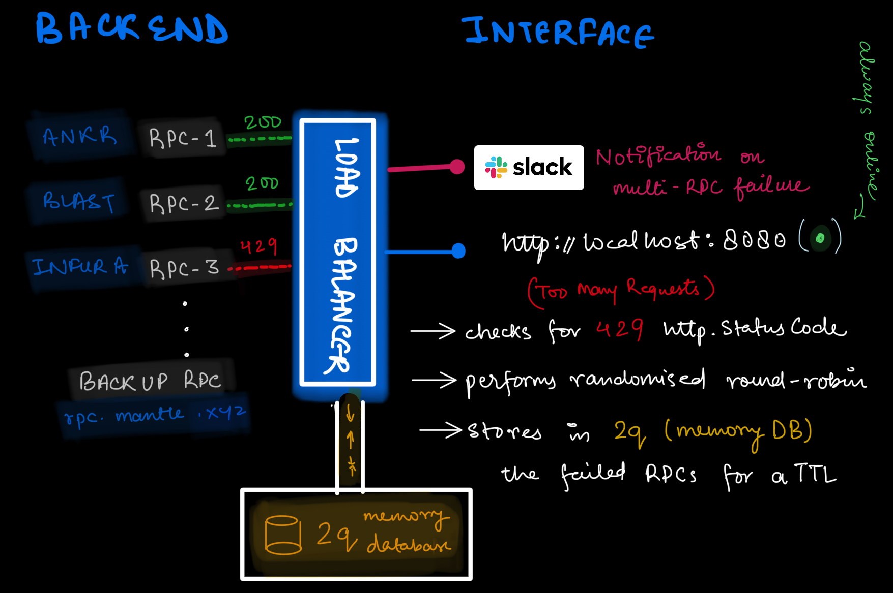

# Load Balancer 🚀

This project implements an advanced HTTP load balancer in Go written according to a specific use case (randomized round-robin). The load balancer forwards incoming HTTP requests to a list of primary RPC (Remote Procedure Call) endpoints. If all primary endpoints fail, it falls back to a secondary list of RPC endpoints. Additionally, it includes a caching mechanism to temporarily avoid failed endpoints and a notification system to alert when all endpoints are down. 📡

## Architecture 🏗️


## Logic Overview 🧠

1. **Initialization**:
   - The `.env` file is loaded to fetch the primary and fallback RPC URLs.
   - The URLs are split into slices and stored in global variables.
   - The application fails to start if no primary or fallback RPCs are provided. ❌

2. **Main Function**:
   - Initializes a cache to store failed URLs temporarily using an in-memory database. 🗃️
   - Starts an HTTP server that listens for incoming requests. 🌐

3. **Load Balancer**:
   - Handles incoming HTTP requests and attempts to forward them to the primary RPCs. 📬
   - If all primary RPCs fail, it tries the fallback RPCs. 🔄
   - If both primary and fallback RPCs fail, it sends a notification to Slack and returns an error response. 🚨

4. **Request Forwarding**:
   - Shuffles the list of URLs to distribute the load. 🔀
   - Forwards the request to each URL until a successful response is received. ✅
   - If a URL returns a "Too Many Requests" status, it is cached in a Two-Queue (2Q) in-memory database to avoid retrying it for a specified TTL (time-to-live). ⏳

5. **Caching Mechanism**:
   - Uses a Two-Queue (2Q) in-memory caching algorithm to store failed URLs. 🗄️
   - The cache temporarily stores URLs that fail to respond or return a "Too Many Requests" status, preventing repeated attempts to the same failing endpoint. 🚫
   - `ERROR_TIME_TO_LIVE_MINUTES` is the time-to-live (TTL) for each URL in the cache. ⏲️

6. **Slack Notification**:
   - Sends a notification to Slack when all RPC endpoints fail to `SLACK_WEBHOOK_URL`. 📩

## Docker  🐳

The `Dockerfile` is used to build a lightweight Docker image for the load balancer. It follows a multi-stage build process to minimize the final image size:

1. **Builder Stage**:
   - Uses the official Go image as the base image.
   - Copies the source code into the image.
   - Builds the Go binary for Linux using `go build`.

2. **Runner Stage**:
   - Uses the `scratch` image as the base, which is an empty image.
   - Copies the compiled binary from the builder stage.
   - Exposes the specified port.
   - Sets the command to run the binary when the container starts.

This multi-stage build process ensures that the final image only contains the compiled binary and its runtime dependencies, resulting in a highly optimized and small image size.

## Docker Compose Setup 🐙

The `docker-compose.yml` file is used to define and run the load balancer service using Docker Compose. It includes the following configuration:

- **Service Definition**:
  - Specifies the service name as `load-balancer`.
  - Sets the build context and Dockerfile location.
  - Assigns the image name as `loadbalancer`.

- **Environment Variables**:
  - Sets the `ENV` environment variable to `production`.
  - Loads additional environment variables from the `.env` file.

- **Port Mapping**:
  - Maps the container port to the host port specified in the `PORT` environment variable.

- **Restart Policy**:
  - Configures the service to restart unless stopped manually.

To start the load balancer using Docker Compose, run the following command:
   
   ```bash
   docker-compose build
   docker-compose up [-d]
   ```
## Example

To test the load balancer, you can use `curl http://localhost:8080` to send an HTTP request to the load balancer. The load balancer will forward the request to the primary and fallback RPC endpoints based on the configuration. 🧪
